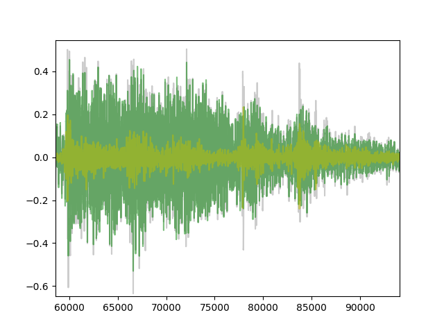
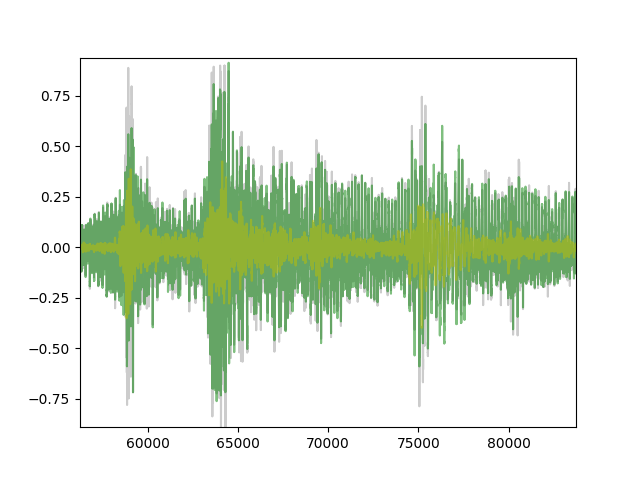

# Assignment 10: A multi-resolution sinusoidal model

Audio Signal Processing for Musical Applications

David Antliff, May 2017

## Introduction

The time-frequency trade-off of the FFT results in compromise either for
 frequency resolution or time resolution. This becomes apparent when,
 for example, a sound with low and high frequency tones and fast onsets
 is analysed. In order to catch the fast onset, a small window (and FFT)
 is required to reduce time smearing however because frequency resolution
 is inversely proportional to the FFT size, this smaller window results
 in lower frequency resolution. If a larger FFT size is used, the frequency
 resolution will be better at the cost of time smearing, thereby losing
 accuracy in the timing of the sinusoids.

Therefore the _single_ window approach will either provide an accurate
time-based capture of the sound's attack, or an accurate frequency-based
capture of the sound's pitch.

Using a multi-resolution approach allows for a sound to be captured with
 both good time and frequency resolution by dividing the frequency spectrum
 into several bands. For each band, a separate window and FFT size can be
 used. This allows, for example, analysis of a sound's low-frequencies to
 be accurate, and still allow for the higher-frequency onsets to be detected
 accurately in the time domain.

The trade-off is increased code complexity and processing time.

## Code

The code for this assignment may be found [here](https://github.com/DavidAntliff/ASPMA/blob/master/A10/A10.py).

## Sounds chosen

The following sounds were chosen for analysis. They are both polyphonic
and have melodic and percussive components. They are based on real instruments
however in both cases they originate from third-party sample packs.

### Sound 1

[Orchestral Loop with Oriental Touch](http://freesound.org/people/toam/sounds/193328/)

Needed to be converted to a 44,100 Hz mono wav file:

`sox 193328__toam__orchestral-loop-with-oriental-touch.flac -c1 sound1.wav`

### Sound 2

[Bangui Flower](http://freesound.org/people/Insidebeat/sounds/249194/)

Needed to be converted to a 44,100 Hz mono wav file:

`sox -v0.9 249194__insidebeat__bangui-flower.wav -c1 sound2.wav`

## Parameter justification

N is the FFT size, M is the window size. SNR determined by comparing the
synthesis output with the original sound is used as a quantitative metric.

A zoomed plot is provided for visual comparison, and audio samples are provided.

It is difficult to determine the accuracy of the frequency resolution if
the original instrument pitches are not known, so this analysis attempts to
improve the time resolution for transient sounds while maintaining large
FFT windows elsewhere.

### Sound 1

As a baseline, the original `sineModel` algorithm with a N=1024, M=1023
results in an SNR of 12.29 dB.

Listen to [sound1_baseline.wav](https://github.com/DavidAntliff/ASPMA/blob/master/A10/report/sound1_baseline.wav)

This plot shows the original sound in grey, the baseline synthesis in pink,
and the difference between the synthesised and original in purple.
The plot is zoomed in time to show more detail.


#### Trial 1:

```
       0-1000  Hz: N=4096, M=4095
    1000-5000  Hz: N=2048, M=2047
    5000-22050 Hz: N=1024, M=1023
```

Results in an SNR of 11.81 dB, close to the single-band analysis.

Both the single-band and multi-band synthesis sounds the same to me, and
quite similar to the original sound.

Listen to [sound1_trial1.wav](https://github.com/DavidAntliff/ASPMA/blob/master/A10/report/sound1_trial1.wav).

This plot shows the original sound in grey, the baseline synthesis in dark green,
and the difference between the synthesised and original in light green.
The plot is zoomed in time to show more detail.


#### Trial 2:

There is a percussive tom and cymbal that sounds slightly smeared in time to me.
To improve the time resolution in the middle-range frequencies, the lower band limit
is moved down, reducing the FFT size for the range 200-5000 Hz and therefore improving
time resolution in this band:

```
       0-200   Hz: N=4096, M=4095
     200-5000  Hz: N=2048, M=2047
    5000-22050 Hz: N=1024, M=1023
```

This slightly improves the SNR to 11.84 dB - not much different.

Listen to [sound1_trial2.wav](https://github.com/DavidAntliff/ASPMA/blob/master/A10/report/sound1_trial2.wav)

This plot shows the original sound in grey, the baseline synthesis in dark green,
and the difference between the synthesised and original in light green.
The plot is zoomed in time to show more detail.


#### Trial 3:

As an experiment, the FFT sizes are now all halved:

```
       0-200   Hz: N=2048, M=2047
     200-5000  Hz: N=1024, M=1023
    5000-22050 Hz: N=512, M=511
```

This gives an improved SNR of 12.35, which is better than the `sineModel` baseline SNR.

I am not skilled enough to detect whether the output is better than Trial 2, but it's certainly not worse.

Listen to [sound1_trial3.wav](https://github.com/DavidAntliff/ASPMA/blob/master/A10/report/sound1_trial3.wav).

This plot shows the original sound in grey, the baseline synthesis in dark green,
and the difference between the synthesised and original in light green.
The plot is zoomed in time to show more detail.



I think this plot clearly shows that the first transient is much better followed by these
parameters than the previous two trials.

### Sound 2

As a baseline, the original `sineModel` algorithm with a N=1024, M=1023
results in an SNR of 9.65 dB.

Listen to [sound2_baseline.wav](https://github.com/DavidAntliff/ASPMA/blob/master/A10/report/sound2_baseline.wav).

This plot shows the original sound in grey, the baseline synthesis in pink,
and the difference between the synthesised and original in purple.
The plot is zoomed in time to show more detail.


#### Trial 1

Based on the analysis from Sound 1, I decided to start with the same
parameters as Trial 3, since they seem to provide a good balance between time and
frequency resolution.

```
       0-200   Hz: N=2048, M=2047
     200-5000  Hz: N=1024, M=1023
    5000-22050 Hz: N=512, M=511
```

This gives an SNR of 9.40, which is slightly below the baseline.

Listen to [sound2_trial1.wav](https://github.com/DavidAntliff/ASPMA/blob/master/A10/report/sound2_trial1.wav).

This plot shows the original sound in grey, the baseline synthesis in pink,
and the difference between the synthesised and original in purple.
The plot is zoomed in time to show more detail.


To me this sounds like the percussion is slightly smeared, especially at
higher frequencies.

#### Trial 2

To try to reduce the time smearing at higher frequencies, let's increase the lower
limit of the top band to use a smaller FFT for frequencies around 3000-5000 Hz:

```
       0-200   Hz: N=2048, M=2047
     200-3000  Hz: N=1024, M=1023
    3000-22050 Hz: N=512, M=511
```

This also gives an SNR of 9.41, which is slightly below the baseline and
is not really an improvement over Trial 1.

Listen to [sound2_trial2.wav](https://github.com/DavidAntliff/ASPMA/blob/master/A10/report/sound2_trial2.wav).

This plot shows the original sound in grey, the baseline synthesis in pink,
and the difference between the synthesised and original in purple.
The plot is zoomed in time to show more detail.



I'm not convinced that this has resulted in much improvement over the baseline.
There may be better results found by automated scanning through boundaries
and FFT sizes, perhaps looking for a local maxima in SNR.

## Observations

As mentioned in the introduction, the goal of this multi-resolution approach
is to try to improve the time resolution for transient sounds, that our ear is
sensitive to, while also retaining good frequency resolution at lower frequencies.

I think that the baseline model `sineModel` is pretty good at determining
frequencies due to quadratic interpolation. This allows the low frequency
resolution due to smaller FFT sizes to be mitigated somewhat. Therefore the
improvements from this multi-resolution approach are difficult to determine.

I found it challenging to detect improvements by ear alone. In most cases the visual
time-domain plot helped me better understand the effects of changing parameters.

Computationally, this approach does add to the CPU workload by requiring
more FFTs to be calculated for each audio frame. Although it does allow for
smaller FFTs to be used, the computational cost is significant. Additionally,
once all the FFTs have been calculated, they must be filtered to extract
the correct sinusoidal components for each band. If there are many peaks detected
then this may be computationally expensive.

## Challenges with HPR and HPS

The HPR and HPS models require tracking of moving sinusoids and estimation
of the fundamental frequency using harmonic series best-fit matching.

Sinusoidal tracking would pose a problem where sinusoids move away into
adjacent bands. The algorithm would need to be able to "hand over" moving
sinusoids to adjacent bands in such a way that the frequency error caused
by a different frequency resolution in the new band is not audible.

Fundamental (F0) estimation also poses a problem because the harmonic
 series best-fit must be applied across multiple frequency bands, and
 because the frequency resolution changes between bands, it may cause
 offsets in the harmonic series that are more difficult to match.

## Further methods

It may be possible to adjust the bands and FFT sizes dynamically. As the
human ear is particularly sensitive to transients, it may be effective
to pre-scan the input audio to detect such transients, and then adjust
the parameters to minimise time smearing at those points, using smaller
FFTs.


